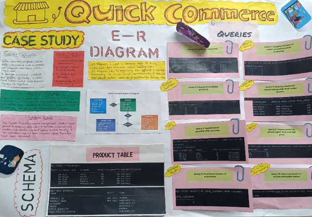

# 🛒 Quick Commerce Database Management System

## 📖 Overview

The **Quick Commerce Database Management System** is a relational database project developed using **Oracle SQL** and **SQL*Plus**. The system is designed to manage customer information, product inventory, orders, and order details for a quick commerce platform. It demonstrates database design, normalization, relational schema creation, and SQL operations for real-world business scenarios.

---

## ✨ Features

- 👤 Customer Management
- 📦 Product Management
- 🛍️ Order Management
- 📑 Order Item Management
- 🗂️ ER Diagram Design
- 🏗️ Relational Schema Design
- 🔑 Primary & Foreign Key Constraints
- 📊 Database Normalization
- 💾 SQL*Plus Implementation
- 📈 Aggregate Functions
- 🔄 Joins and Subqueries
- 📋 GROUP BY & HAVING
- ⚙️ DDL & DML Operations
- ✔️ Data Validation using Constraints

---

## 🛠️ Technologies Used

- Oracle SQL
- SQL*Plus
- Database Management System (DBMS)
- ER Modeling
- Relational Database Design

## 📊 DBMS CHART



---

## 📂 Project Structure

```text
Quick-Commerce-DBMS/
│
├── SQL/
│   ├── create_tables.sql
│   ├── insert_data.sql
│   └── queries.sql
│
├── Documentation/
│   ├── Quick_Commerce_DBMS.pdf
│   ├── Quick_Commerce_DBMS_Case_Study.pdf
│   ├── Quick_Commerce_DBMS_ER_Design.pdf
│   ├── Quick_Commerce_DBMS_Schema_Design.pdf
│   └── Quick_Commerce_DBMS_SQL_Queries.pdf
│
├── README.md
├── LICENSE
└── .gitignore
```

---

## 🗄️ Database Tables

- CUSTOMER
- PRODUCT
- ORDERS
- ORDER_ITEM

---

## 🔍 SQL Functionalities

- CREATE
- ALTER
- INSERT
- UPDATE
- DELETE
- SELECT
- Aggregate Functions
- GROUP BY
- HAVING
- Joins
- Subqueries
- Constraints

---

## 🎯 Learning Outcomes

This project strengthened my understanding of:

- Relational Database Design
- Database Normalization
- ER Modeling
- SQL Programming
- Oracle SQL*Plus
- Primary & Foreign Keys
- Joins
- Aggregate Functions
- Database Constraints

---

## 🚀 Future Enhancements

- Delivery Management Module
- Payment Management
- Warehouse Management
- Supplier Management
- Customer Reviews
- Sales Analytics Dashboard
- Role-Based Access Control
- Integration with a Web Application

---

## 📄 Documentation

The repository contains:

- Complete Case Study
- ER Diagram
- Schema Design
- SQL Scripts
- SQL Query Demonstrations
- Project Report

---

## 👨‍💻 Developed By

**Tushar L. Devendra**

B.Sc. Information Technology

SVKM's Usha Pravin Gandhi College (Mumbai University)

🔗 GitHub

https://github.com/devtusharhq

---

## ⭐ Support

If you found this project useful, consider giving it a ⭐.
